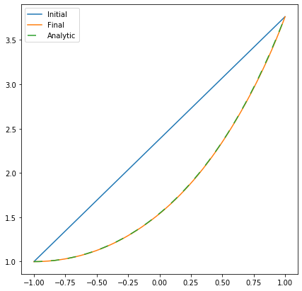

PyRitz
=======

PyRitz is a library for

A python package for direct variational minimisation, specifically suited for finding Freidlin-Wentzell instantons.

## Usage

```python
import pyritz, nlopt

# Define the Lagrangian

def lagrangian(ls, dxls, dvls, path, xs, args):
    ys, dys = path
    ls[:] = 2*np.pi*np.abs(ys)*np.sqrt(1 + dys*dys)

# Define the end-point conditions
y1 = np.cosh(0)
y2 = np.cosh(2)

# Set the interpolation and the quadrature order
n = 8
nq = n*10

# Define the initial path for the minimiser
alpha0 = pyritz.interpolation.utils.linear_path(y1, y2, n)

# Setup the path-interpolation and action quadrature of the system using PyRitz
action = pyritz.interpolation.Action(lagrangian, n, nq, x1, x2)

# Minimize the action using NLopt
opt = nlopt.opt(nlopt.LN_NEWUOA, np.size(alpha0))
opt.set_lower_bounds(np.full(np.size(alpha0), 0))
opt.set_min_objective(action.compute)
opt.set_xtol_rel(1e-10)
alpha = opt.optimize(alpha0)

print("S[alpha0] = %s" % path.action(alpha0))
print("S[alpha]  = %s" % path.action(alpha))
```

Plot the result:

```python
def analytic_sol(xs):
    return np.cosh(1 + xs)

xs = np.linspace(-1, 1, 1000)

paths = [
    (action.get_alpha_with_endpoints(alpha0), "Initial"),
    (action.get_alpha_with_endpoints(alpha), "Final")
]

for _alpha, _label in paths:
    ys = pyritz.interpolation.utils.interpolate(_alpha, n, ts)
    plt.plot(ts, ys[0,:], label=_label)

plt.plot(xs, analytic_sol(xs), "--", dashes=(8, 8), label="Analytic")
plt.legend()
mpl.pyplot.gcf().set_size_inches(7, 7)
```



For more examples, click [here](https://github.com/lukastk/PyRitz/tree/master/examples).

## Installation

### Running the PyRitz examples

It is possible to try out PyRitz *without* installing it to your system (this was only tested on Linux). The script *setup_nlopt_locally.sh* installs NLopt into the repository, so that the examples can be run locally.

```
git clone https://github.com/lukastk/PyRitz.git
cd PyRitz
sh setup_nlopt_locally.sh
cd examples
jupyter notebook
```

### Installing from the repository

```
git clone https://github.com/lukastk/PyRitz.git
cd PyRitz
python setup.py install
```

You must also install the [dependencies](#dependencies). The most straight-forward way to install PyRitz and its dependencies is through [Anaconda](https://www.anaconda.com/distribution/).

```
conda install numpy
conda install scipy
conda install -c conda-forge nlopt
```

For plotting:

```
conda install matplotlib
```

## Dependencies

- [NumPy](https://numpy.org/)
- [SciPy](https://www.scipy.org/)
- [NLopt](https://nlopt.readthedocs.io/en/latest/)

To run the examples you need:

- [Jupyter Notebook](https://jupyter.org/) (Easiest way to  install this is via [Anaconda](https://www.anaconda.com/distribution/))
- [Matplotlib](https://matplotlib.org/)

## Publications

*Ritz method for transition paths and quasipotentials of rare diffusive events*. L. T. Kikuchi, R. Singh, M. E. Cates, R. Adhikari (To be published)

## Citing PyRitz

If you use PyRitz for academic work, we would request you to cite our papers.

## License

PyRitz is published under the [MIT License](https://opensource.org/licenses/MIT).

This repository includes code from [NLopt](https://nlopt.readthedocs.io/) which is under the [GNU Lesser General Public License](https://en.wikipedia.org/wiki/GNU_Lesser_General_Public_License), developed by [Steven G. Johnson](https://github.com/stevengj).

## Authors

[Lukas Kikuchi](https://github.com/lukastk), [Rajesh Singh](https://github.com/rajeshrinet), Mike Cates, [Ronojoy Adhikari](https://github.com/ronojoy)
